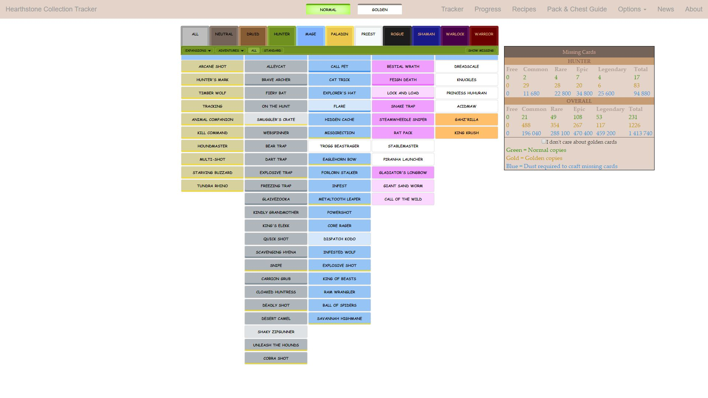
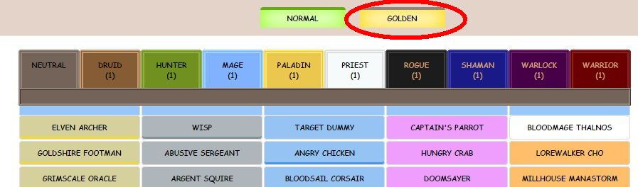
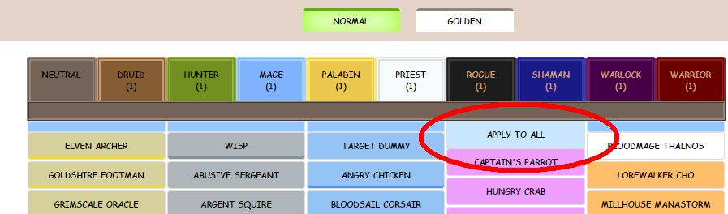
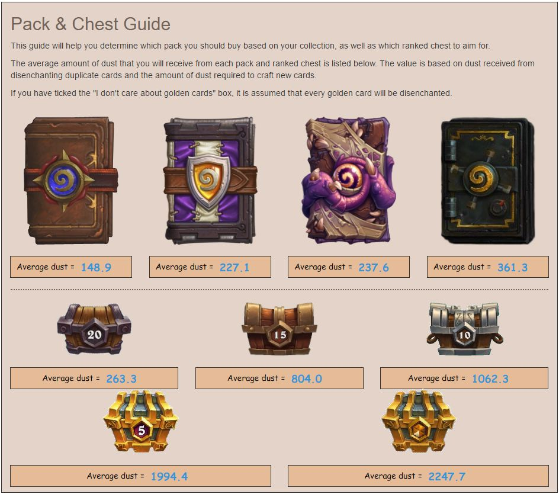

# Hearthstone Collection Tracker
Tracks your Hearthstone card collection. Lets you know exactly how many normal and golden cards are missing for each class and in total. Also shows the dust required to craft the missing cards, and the Pack Guide tells you the most efficient pack to buy based on your collection.

Website can be found at http://freezard.github.io/hs-collection-tracker

## FEATURES
- Keeps track of how many normal and golden copies you have of each card.
- Import your entire collection from HearthPwn or add cards by clicking on them.
- Add all copies of a selected card rarity in one click.
- Each class has their cards listed in their own tab, or list everything in the All tab.
- Infobox displaying the number of missing copies and dust required to complete a set or your whole collection.
- Filter cards by expansion/adventure set, or by Standard/Wild.
- Option to only show cards where at least one normal or golden copy is missing.
- Option to ignore golden copies if only interested in collecting normal copies.
- The Pack Guide lets you know which card pack is the most valuable based on your collection.
- Your collection and settings are saved locally in the browser. Option to save and load to file.
- Tracker is updated whenever new cards are released or changed.
- Supports all modern browsers and devices such as iPhone/iPad.

## USAGE
- Select whether you want to add or remove a normal or golden card.

  
- Left-click on a card to add a copy, right-click to remove a copy.
- To fill or clear an entire column, click on the blue button at the top of a column. This only applies to the selected card quality.

  
The Pack Guide helps you determine whether to buy Classic or expansion packs.

  
